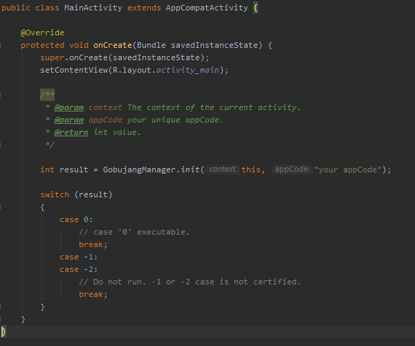

# gobujang
[](https://jitpack.io/#gobujang/gobujang)

## 1. Gradle
**Add it in your root build.gradle(project).**
```gradle
allprojects {
    repositories {
        ...
        maven { url 'https://jitpack.io' }
    }
}
```
<p>

</p>

**Add the dependency build.gradle(module).**
```gradle
dependencies {
    ...
    implementation 'com.github.gobujang:gobujang:0.0.1'
}
```
<p>

</p>
 
## 2. Build aar file
**Copy and Paste the aar file to your project's libs folder.**     
**Implementation '[package name]: [file name]: [version code] @aar' build.gradle.**
```gradle
repositories {
    flatDir {
        dirs 'libs'
    }
}

dependencies {
    ...
    implementation 'com.gbj.module.gobujang:gobujang:0.1@aar'
}
```
<p>

</p>    

[Download aar file](download/gobujang_aar.zip)

## 3. Build jar file
**Copy and Paste the jar file to your project's libs folder.**    
**Right-click on the jar file and click the Add As Library... menu.**
<p>

</p>

[Download jar file](download/gobujang_jar.zip)

## 4. Referencing a Library Project
**Download gobujang.zip**

[Download gobujang file](download/gobujang.zip)

**Add library module to settings.gradle.**    
**Confirm that the library has been added to the project list.**
```gradle
include ':app',':gobujang'
project(':gobujang').projectDir = new File('downloaded file location')
```
<p>

</p>    

**Compile the library in build.gradle.**
```gradle
dependencies {
    ...
    implementation project(':gobujang')
}
```
<p>

</p>
 
## Usage
**Then** *GobujangManager.init()* **it in onCreate() Method of application class :**
```java
    @Override
    protected void onCreate(Bundle savedInstanceState) {
        super.onCreate(savedInstanceState);
        setContentView(R.layout.activity_main);

        GobujangManager.init(context, "appcode");
    }
```
<p>

</p>
 
**This method** *GobujangManager.init()* **is used to communicate**     
**between the library's broadcast receiver and the gobujang server application's broadcast receiver.**

## Processing according to result value.
**For Case=0 result, the app executes.  This is the case when the user has been verified and authenticated.**   
**For Case = -1, -2 or no reply from the server, the DominiGames displays “Play the game in gobujang application” (in Korean/Japanese as the case may be). **    
**When the User clicks “OK” tab, Gobujang web page will pop-up.**   
incase of KOREAN game, popup message or website is KOREAN, JAPAN case popup with japanease. ( please check it )    

**KOREAN**
*"고부장닷컴 앱에서 게임을 실행해주세요."*     
website(KO) https://www.gobujang.com/     

**JAPANESE**
*"GO部長ドットコムのアプリでゲームを実行してください。"*    
website(JP) https://www.gobucho.com/     

>You need to work directly with the termination of the APP because it is assumed that 
the APP is illegally duplicated or that the game is not played due to a code error. (case -1 or -2)
This is in case of DRM doesn't work. - due to hacking or craking.
On the DRM side, we can determine whether the product is genuine or not, and the APP will operate within the code of the game.
Under normal circumstances, do all controls on the DRM side.

## Remove or disable shortcut icon function.
**If your build includes a code that automatically installs app launch shortcut icon, please remove or disable this function.**    
    
*AndroidManifest.xml*    
Example of shortcut icon code:  
```java
<intent-filter>
    <action android:name="android.intent.action.MAIN"/>
    <category android:name="android.intent.category.LAUNCHER" />
    <category android:name="android.intent.category.LEANBACK_LAUNCHER" />
</intent-filter>
```    
Remove the code below.
```java
    <category android:name="android.intent.category.LAUNCHER" />
    <category android:name="android.intent.category.LEANBACK_LAUNCHER" />
```    
**After the removal of the shortcut icon function, please provide the following information:**    
**packageName & Activity Name of <android.intent.category.MAIN>.**


## After the build process
**After the build package is uploaded somewhere (for example, Google Drive), let us know the upload link on our CP page.**
