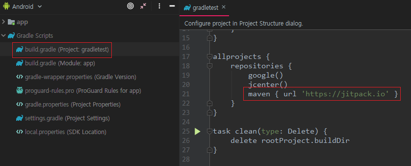
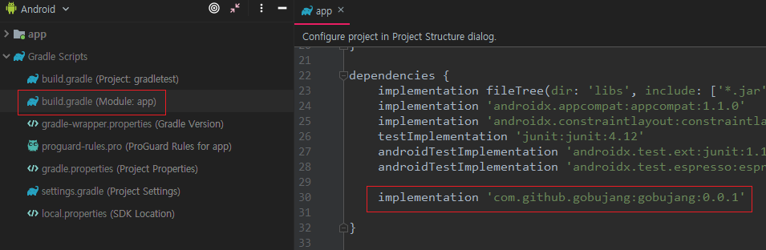
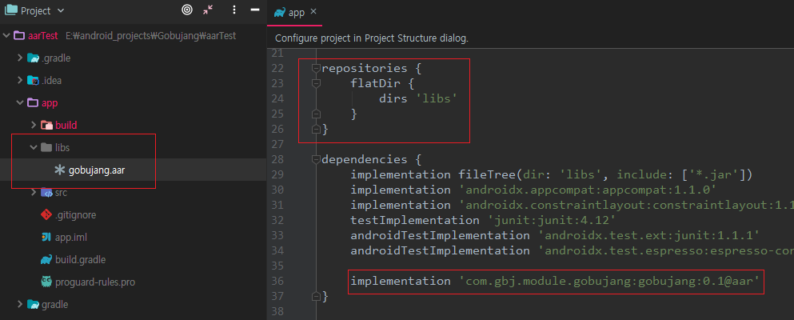
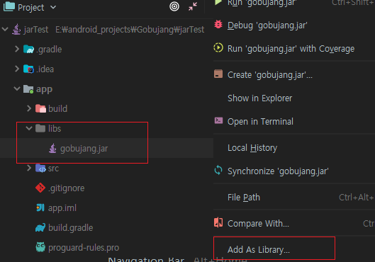
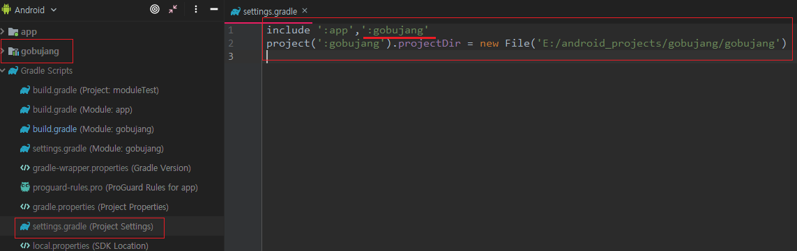
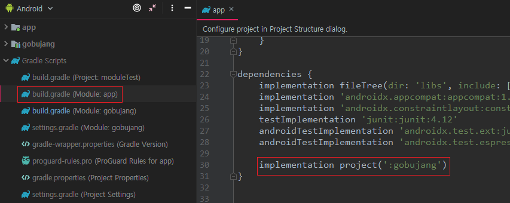
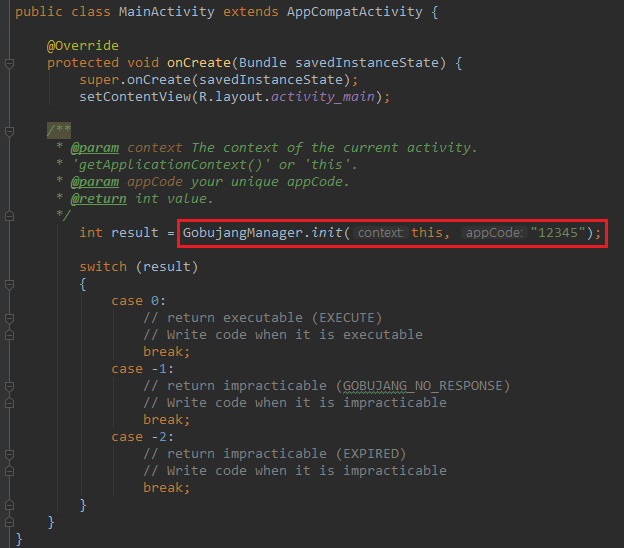

# gobujang


## Gradle
**Add it in your root build.gradle(project).**
```gradle
allprojects {
    repositories {
        ...
        maven { url 'https://jitpack.io' }
    }
}
```
<p>

</p>

**Add the dependency build.gradle(module).**
```gradle
dependencies {
    ...
    implementation 'com.github.gobujang:gobujang:[version]'
}
```
<p>

</p>
 
## Build aar file
**Copy and Paste the aar file to your project's libs folder.**     
**Implementation '[package name]: [file name]: [version code] @aar' build.gradle.**
```gradle
repositories {
    flatDir {
        dirs 'libs'
    }
}

dependencies {
    ...
    implementation 'com.gbj.module.gobujang:gobujang:0.1@aar'
}
```
<p>

</p>    

[Download aar file](download/gobujang_aar.zip)

## Build jar file
**Copy and Paste the jar file to your project's libs folder.**    
**Right-click on the jar file and click the Add As Library... menu.**
<p>

</p>

[Download jar file](download/gobujang_jar.zip)

## Referencing a Library Project
**Download gobujang.zip**

[Download gobujang file](download/gobujang.zip)

**Add library module to settings.gradle.**    
**Confirm that the library has been added to the project list.**
```gradle
include ':app',':gobujang'
project(':gobujang').projectDir = new File('downloaded file location')
```
<p>

</p>    

**Compile the library in build.gradle.**
```gradle
dependencies {
    ...
    implementation project(':gobujang')
}
```
<p>

</p>
 
## Usage
**Then** *GobujangManager.init()* **it in onCreate() Method of application class :**
```java
    @Override
    protected void onCreate(Bundle savedInstanceState) {
        super.onCreate(savedInstanceState);
        setContentView(R.layout.activity_main);

        GobujangManager.init(context, "appcode");
    }
```
<p>

</p>
 
**This method** *GobujangManager.init()* **is used to communicate**     
**between the library's broadcast receiver and the gobujang server application's broadcast receiver.**

